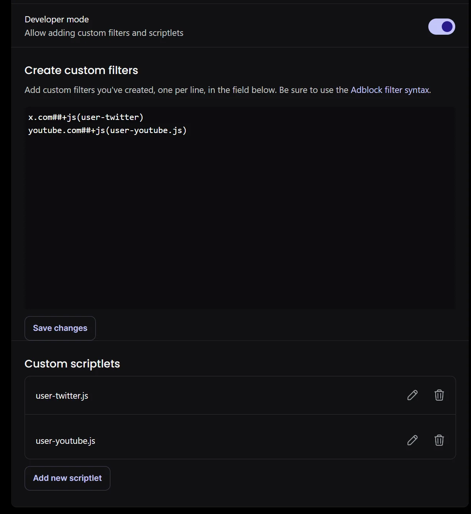
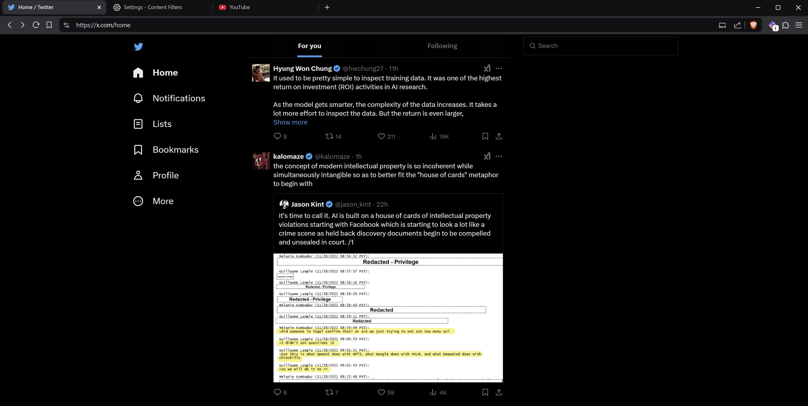

# My Custom script for brave browser

Scripts I use personally.

Feel free to use it or modify for your own needs.

## Usage

Go in `brave://settings/shields/filters`, put developer mode on, and create custom filters like:

- x.com##+js(user-twitter)
- youtube.com##+js(user-youtube.js)
- Example domain##+js(user-example.js) # Add your own filters here

And add custom scriptlets too

## Example

## Twitter

### What's changed on Twitter:

- **Replaces "X" branding back to "Twitter" (logos, text, favicon and title)**
- **Replaces t.co links to their actual URL**
- Removes "Who to follow" section
- Removes footer
- Removes Grok button/drawer
- Removes messaging section
- Removes navigation buttons (Search, Grok, List, Jobs, Communities, Premium, Verified Orgs, Messages, Post)
- Removes trending ("What's happening") section
- Removes border lines
- Removes account menu section
- Applies minimalist square design:
  - Removes all rounded corners
  - Adds minimal black webkit scrollbar
  - Removes shadows and borders
  - Sets pure black background

### YouTube

- Applies minimalist square design:
  - Removes all rounded corners
  - Sets pure black background everywhere
- Removes microphone/voice search button
- Removes Shorts section and button from sidebar
- Removes Shorts shelf/carousel from main feed
